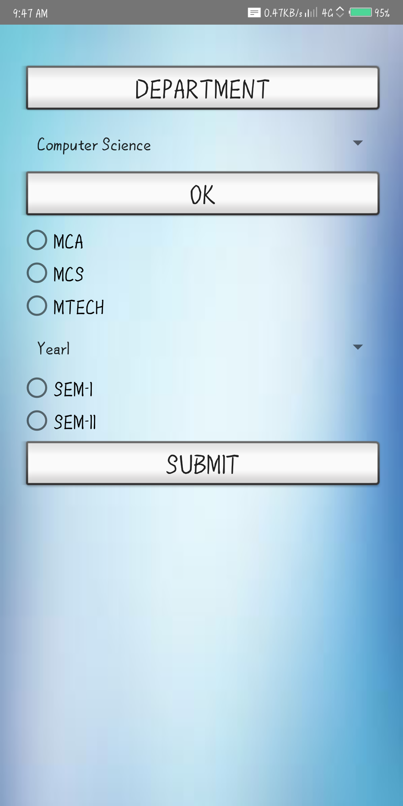
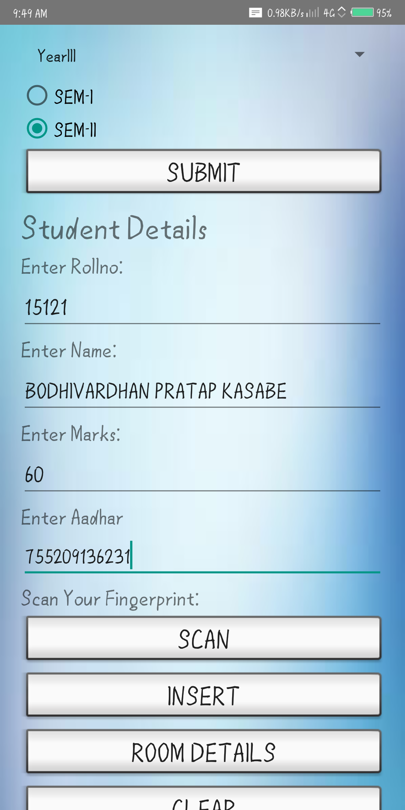
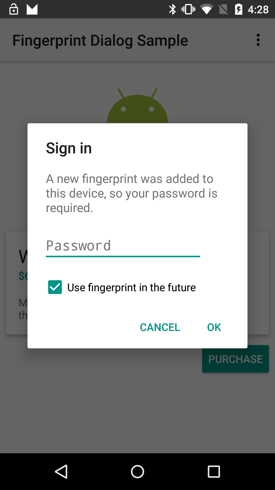

Android FingerprintDialog Sample
===================================

A sample that demonstrates to use registered fingerprints to authenticate the user in your app

Introduction
------------

This is Smple Hostel-Managment project whih contais login page first we have to signup by adding details of student 
and then login by using Addhar number for this verification verhoff algorithm is used for Aadhar verification then it 
also contains anather pages like room details it contains all room details like tube-light,bulb,chair,fan,etc and student 
leave the collage check it all are ok or not if not fine to pay by student.Etc.

Pre-requisites
--------------

- Android SDK 24
- Android Build Tools v25.0.3
- Android Support Repository

Screenshots
-------------

 
 

Getting Started
---------------

This sample uses the Gradle build system. To build this project, use the
"gradlew build" command or use "Import Project" in Android Studio.

Support
-------

- Google+ Community: https://plus.google.com/communities/105153134372062985968
- Stack Overflow: http://stackoverflow.com/questions/tagged/android

Patches are encouraged, and may be submitted by forking this project and
submitting a pull request through GitHub. Please see CONTRIBUTING.md for more details.

License
-------

Copyright 2017 The Android Open Source Project, Inc.

Licensed to the Apache Software Foundation (ASF) under one or more contributor
license agreements.  See the NOTICE file distributed with this work for
additional information regarding copyright ownership.  The ASF licenses this
file to you under the Apache License, Version 2.0 (the "License"); you may not
use this file except in compliance with the License.  You may obtain a copy of
the License at

http://www.apache.org/licenses/LICENSE-2.0

Unless required by applicable law or agreed to in writing, software
distributed under the License is distributed on an "AS IS" BASIS, WITHOUT
WARRANTIES OR CONDITIONS OF ANY KIND, either express or implied.  See the
License for the specific language governing permissions and limitations under
the License.
